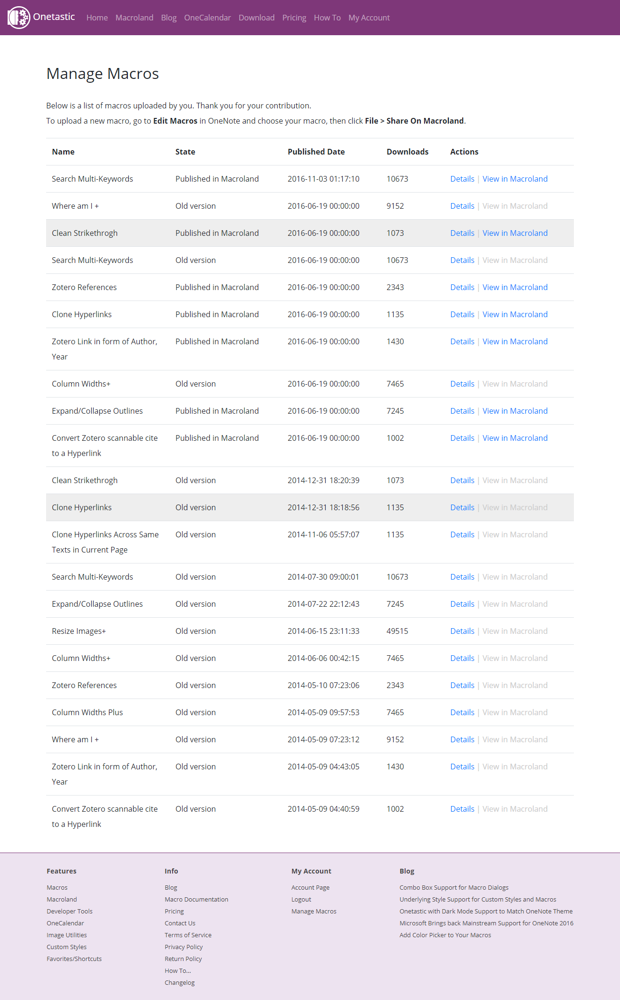

# Onetastic Macros for Microsoft OneNote 2010/2013/2016

[**Onetastic**](https://getonetastic.com/) is a multi-purpose add-in for Microsoft OneNote. One major usage is to perform simple repeated tasks by enabling add, develop and run Macros in OneNote. Its Macro Editor saves its Macro scripts in a XML format, which allows users to import/export and share on [Onetastic Macroland](https://getonetastic.com/macroland).

The following screenshot lists the Macros that I have uploaded to the Marcoland:

